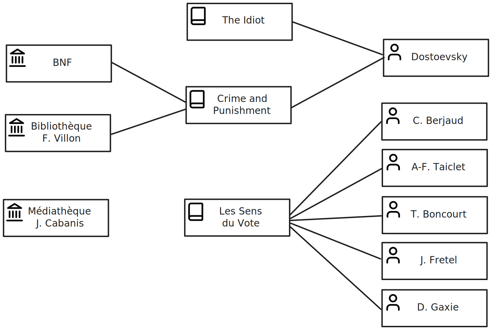
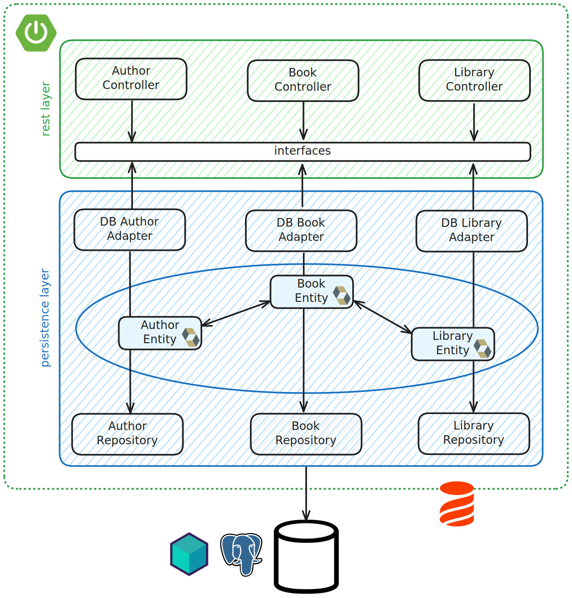
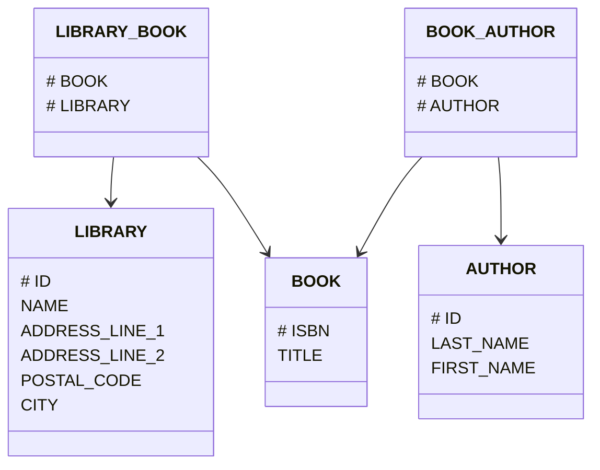

# jOOQ hands-on

  

> This hands-on is available in [Java/Maven](java/README.md) and in [Kotlin/Gradle](kotlin/README.md).

## Steps

> 1. <a href="https://www.jooq.org/doc/latest/manual/sql-building/sql-statements/insert-statement/">The INSERT statement</a>
> 2. <a href="https://www.jooq.org/doc/latest/manual/sql-building/sql-statements/select-statement/#select-from-single-tables">SELECT from single tables</a>
> 3. <a href="https://www.jooq.org/doc/latest/manual/sql-building/sql-statements/select-statement/#select-from-a-complex-table-expression">SELECT from a complex table expression</a>
> 4. <a href="https://www.jooq.org/doc/latest/manual/sql-building/column-expressions/multiset-value-constructor/">MULTISET value constructor</a>
> 5. <a href="https://www.jooq.org/doc/latest/manual/sql-execution/batch-execution/">Using JDBC batch operations</a>
> 6. <a href="https://www.jooq.org/doc/latest/manual/code-generation/codegen-advanced/codegen-config-database/codegen-database-forced-types/codegen-database-forced-types-converter/">Qualified converters</a>
> 7. <a href="https://blog.jooq.org/using-testcontainers-to-generate-jooq-code/">Using Testcontainers to Generate jOOQ Code</a>

## Domain

* Libraries have lots of books available
* Books have been written by 1 or more authors

## Test data

## Architecture

## DB schema

```mermaid
---
  config:
    class:
      hideEmptyMembersBox: true
---
classDiagram
  class LIBRARY {
    # ID
    NAME
    ADDRESS_LINE_1
    ADDRESS_LINE_2
    POSTAL_CODE
    CITY
  }
  class LIBRARY_BOOK {
    # BOOK
    # LIBRARY
  }
  class BOOK {
    # ISBN
    TITLE
  }
  class BOOK_AUTHOR {
    # BOOK
    # AUTHOR
  }
  class AUTHOR {
    # ID
    LAST_NAME
    FIRST_NAME
  }

  LIBRARY_BOOK --> LIBRARY
  LIBRARY_BOOK --> BOOK
  BOOK_AUTHOR --> BOOK
  BOOK_AUTHOR --> AUTHOR
```
