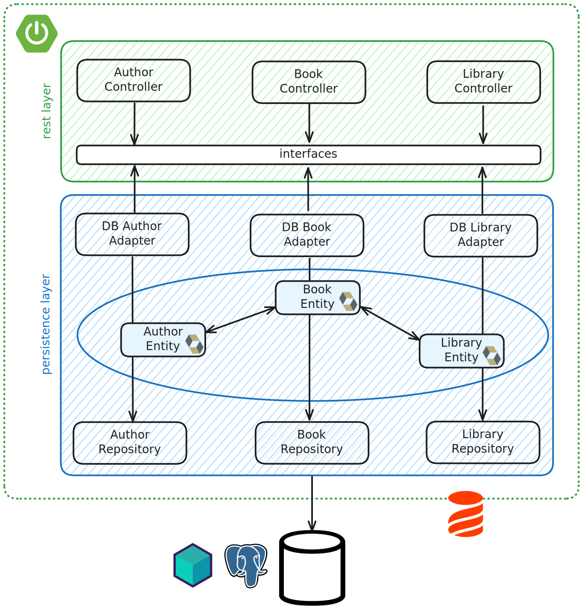

# jOOQ hands-on

  

> This hands-on is available in [Java/Maven](java/README.md) and in [Kotlin/Gradle](kotlin/README.md).

## Domain

* Libraries have lots of books available
* Books have been written by 1 or more authors

## Test data

## Architecture

## DB schema

