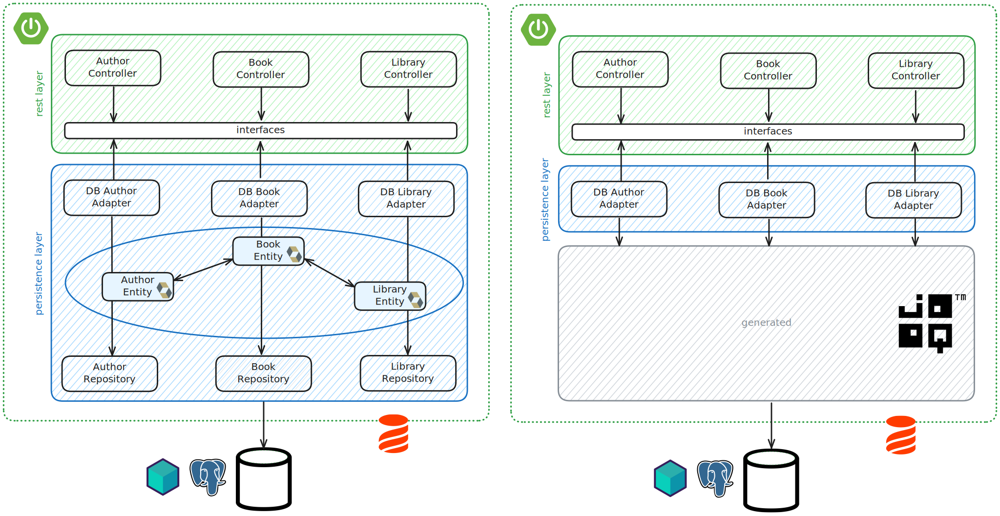

# Wrap-up

## Step back

Let's take a step back and check how the situation has changed.

* Spring Data repositories have been replaced with `DSLContext`.
* :worried: For most basic queries, Spring Data repositories makes it unnecessary to write most common queries. Now, we need to write them explicitly.
* :blush: For complex queries, we use pseudo-SQL instead of a methods with names based on a convention. This allows for more flexibility.
* :blush: Testing queries is easy and feels natural.
* :grin: Entities have been replaced with generated code. No need to maintain them anymore!
* :grin: No more complex annotations.
* :grin: No cyclic dependencies, no lazy loading. Everything is made necessarily explicit.

ORMs came with the need to improve on JDBC. So they got rid of SQL.

SQL was never the problem. We love SQL. What we actually needed was type safety.

## Side notes

* Code generation is not mandatory. But do you really want to do it manually, and even more so have to maintain it?
* jOOQ is not only about typesafe SQL. An active-records approach and [DAO generation](https://blog.jooq.org/to-dao-or-not-to-dao/) are also available.
  It makes sense for CRUD, but that is not what gives relevance to jOOQ.
* jOOQ is free for recent versions of most open source DBs. But you have to pay if you use older versions, or DBs such as Oracle or SQL Server. See the [version support matrix](https://www.jooq.org/download/support-matrix) for detailed info.
* Of course, jOOQ works without Spring. The main difference is that you need to rely on jOOQ to deal with transactions.

## What now?

You should now have everything you need to integrate jOOQ in your real-life application without a big bang effect! :rocket:

## Going one step further

* [JOOQ, Joy of SQL](https://www.youtube.com/watch?v=fW80PwtNJAM) is a great presentation of jOOQ (also available [in French](https://www.youtube.com/watch?v=5m_oE0iPJJE)).
* You can check out alternatives to jOOQ along with some insight on [this repository (Java persistence frameworks comparison)](https://github.com/bwajtr/java-persistence-frameworks-comparison).
