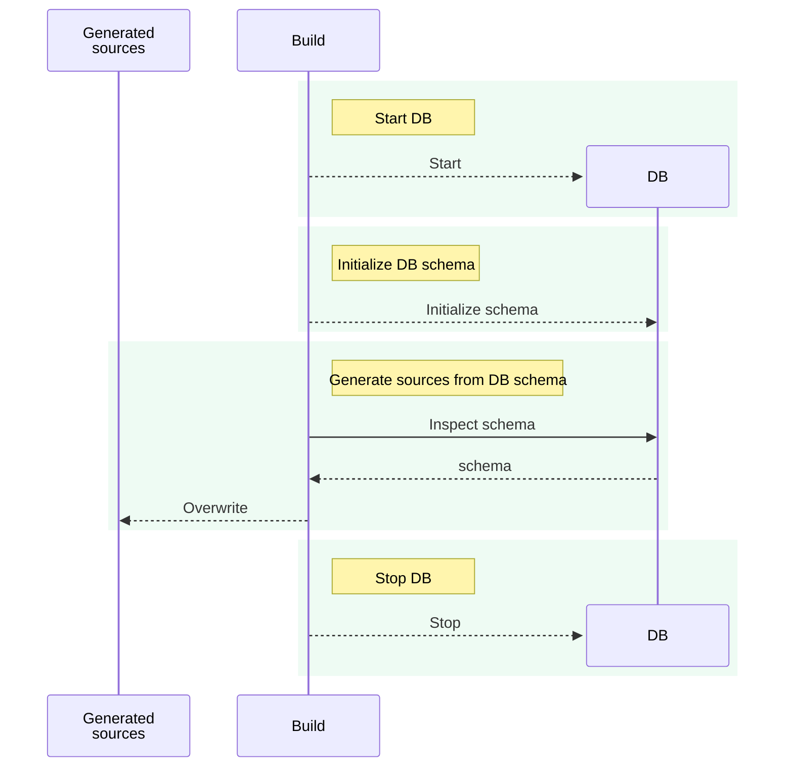

# How jOOQ generates source code from DB schema

```mermaid
sequenceDiagram
  participant generated as Generated<br/>sources
  participant build as Build

  rect rgba(88, 214, 141, 0.1)
    note right of build: Start DB
    create participant db as DB
    build -->> db: Start
  end
  rect rgba(88, 214, 141, 0.1)
    note right of build: Initialize DB schema
    build -->> db: Initialize schema
  end
  rect rgba(88, 214, 141, 0.1)
    note right of build: Generate sources from DB schema
    build ->> db: Inspect schema
    db -->> build: schema
    build -->> generated: Overwrite
  end
  rect rgba(88, 214, 141, 0.1)
    note right of build: Stop DB
    destroy db
    build -->> db: Stop
  end
```
